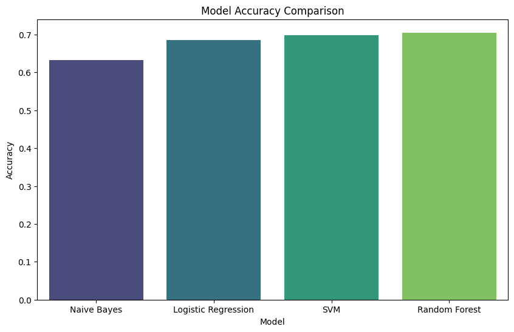
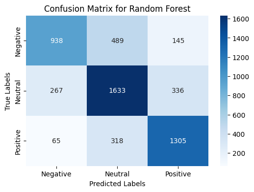

# Sentiment Analysis with Machine Learning Models

This project performs sentiment analysis on a text dataset, training multiple machine learning models to classify text as negative, neutral, or positive sentiment. Using Python and popular NLP and machine learning libraries, this project involves preprocessing text data, vectorizing it, training models, and evaluating them based on accuracy, confusion matrices, and classification reports.

## Project Structure

- `data/`: Contains the dataset (e.g., `train.csv`) with text samples and sentiment labels.
- `notebooks/`: Includes the Jupyter Notebook with the code for preprocessing, training, evaluation, and visualization.
- `README.md`: This file, detailing the project setup and steps.
- `results/`: Contains model evaluation outputs, such as confusion matrices and comparison plots.

## Dataset

The dataset used in this project is a text dataset with sentiment labels. Each row in the dataset includes:
- `textID`: Unique identifier for each sample
- `text`: The text content (tweet, comment, or sentence)
- `selected_text`: A part of the text that may indicate sentiment
- `sentiment`: Target sentiment label (negative, neutral, or positive)

## Requirements

- Python 3.x
- Jupyter Notebook
- Required libraries: `nltk`, `pandas`, `numpy`, `sklearn`, `seaborn`, `matplotlib`, `wordcloud`, `textblob`

You can install the dependencies with:
```bash
pip install nltk pandas numpy scikit-learn seaborn matplotlib wordcloud textblob
```

## Project Workflow

1. **Data Loading and Preprocessing**
   - Load the dataset and handle missing values.
   - Tokenize and clean text data, removing stopwords and punctuations.
   - Encode sentiment labels using ordinal encoding for machine learning compatibility.

2. **Text Vectorization**
   - Transform the cleaned text data into numerical vectors using `TfidfVectorizer` for feature extraction.

3. **Model Training and Evaluation**
   - Train several machine learning models for sentiment classification:
     - Naive Bayes
     - Logistic Regression
     - Support Vector Machine (SVM)
     - Random Forest
   - Evaluate each model on the test set, calculating accuracy and generating a classification report.
   - Plot confusion matrices to visualize each model's performance in predicting each sentiment category.

4. **Results and Visualization**
   - Visualize and compare model performance using bar plots of accuracy scores.
   - Display confusion matrices for each model to examine misclassifications.

## Running the Code

To run the code, open the Jupyter Notebook in the `notebooks/` directory and follow these steps:
1. Run each cell sequentially to load, preprocess, vectorize, and train models.
2. View evaluation metrics and model performance comparisons in the output cells.

## Results

- **Accuracy Comparison**: Displays a bar plot comparing the accuracy of each model.


- **Confusion Matrices**: Provides insight into model performance across each sentiment class.


- **Classification Reports**: Summarize precision, recall, and F1-score for each sentiment label.

## Conclusion

This project demonstrates text classification for sentiment analysis using several machine learning models. The comparison helps in understanding which models perform best on specific types of sentiment data. Future improvements could include using more advanced NLP techniques, such as word embeddings or deep learning models.
